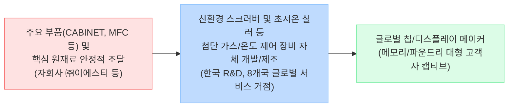

<!-- AI 작성 지침: 이 파일은 Phase 1 최종 보고서 템플릿입니다. 1_Raw_Data의 내용을 바탕으로 빈칸을 채우되, 기존 뼈대(Mermaid 다이어그램, 팩트/내러티브 대조표, 표 양식)를 절대 삭제하거나 축약하지 마십시오. 반드시 풍부한 데이터를 바탕으로 작성하십시오. -->

# 🔍 Phase 1: 기업 해독기 (심층 팩트체크 코어)
**분석 대상**: GST
**기준 데이터**: 최근 5년 DART 공시 (Track A) + 산업 딥리서치 (Track B)

---

## 1. 비즈니스 모델 및 돈 버는 구조

[공시 팩트] 당사(GST)는 반도체 및 디스플레이 제조 공정에서 발생하는 유해 가스를 정화하는 친환경 장비인 **스크러버(Scrubber)**와 공정 챔버 및 장비 온도를 미세하게 제어하여 수율을 높이는 온도 조절 장비 **칠러(Chiller)**의 제조 및 판매를 주력으로 영위하고 있습니다. 반도체 미세화에 따라 식각/증착 공정의 난이도가 상승하고 전력 소모(발열)가 커지면서 이 두 장비는 필수 인프라로 자리 잡았습니다.

### 🔗 밸류체인 다이어그램

## 2. 주요 제품별 매출 비중 추이 (최근 5년 및 최신 분기)

[공시 팩트] 반도체 친환경 트렌드 강화에 따라 스크러버 매출 비중이 절대적 캐시카우 역할을 하고 있으며, 장비 설치 이후 수반되는 용역(유지보수) 매출이 안정적으로 15% 이상을 기여하고 있습니다.

| 구분 | 핵심 내용 (2026년 상반기 기준) | 비고 (과거 대비 트렌드) |
| :--- | :--- | :--- |
| **Scrubber (제품)** | 136,326백만 원 (**63.4%**) | 21~23년(50%대)에서 24년 이후 60~70%대로 지배력 상승 |
| **Chiller (제품)** | 37,739백만 원 (**17.5%**) | 21년 23.3% 대비 비중 다소 축소되었으나 최근 반등 |
| **용역 (유지보수 등)** | 36,190백만 원 (**16.8%**) | 지속적으로 13~21% 사이의 안정적 현금 창출원 역할 수행 |

## 3. 전사 영업이익률 및 FCF 추이

[공시 팩트] 전방 산업의 다운사이클(2023년)에도 비교적 선방했으며, 2024년 이후 다시 외형 성장과 함께 견조한 영업이익률을 회복했습니다. 무리한 CapEx보다 안정적 잉여현금(FCF) 창출에 성공하고 있습니다.

| 구분 | 핵심 내용 (2026년 상반기 기준) | 비고 (과거 대비 트렌드) |
| :--- | :--- | :--- |
| **매출 및 영업이익** | 매출 2,151억 원 / 영업이익 356억 원 | 전년 동기 대비 매출 +26.7%, 영업이익 +32.3%로 강력한 성장 |
| **영업이익률 (OPM)** | **16.57%** | 2021년 이래 꾸준히 15~18%의 탄탄한 마진율 방어 중 |
| **잉여현금흐름 (FCF)** | **295억 원 흑자 (2025년 연간)** | 영업현금흐름 415억 대비 CapEx 120억 통제로 매년 수백억 흑자 시현 |

## 4. 핵심 KPI 추이 및 분석

[시장 내러티브] 전방 산업의 설비 투자 축소로 인해 반도체 장비 부품사들의 전반적 가동률 및 출하량이 급감했을 것이다.

[공시 팩트] 당사는 공장 가동률을 공시하지 않아 실질 장비 생산 대수를 대안 KPI로 추적한 결과, 2023년(바닥) 총 생산수량 2,438대에서 **2024년 2,826대, 2025년 2,878대로 완연한 V자 회복**을 이뤄냈습니다. 특히 2026년 상반기에만 1,842대(연환산 3,600대 이상)를 생산하며 폭발적인 출하 속도를 보이고 있습니다. 
또한 주력 제품인 Scrubber의 **해외 수출 비중이 2023년 39.9%에서 2026년 상반기 49.3%로 급증**하여 글로벌 고객사 캡티브가 공고해지고 있음이 입증되었습니다.

## 5. 경영진 및 주주환원 이력

[공시 팩트] 2024년 주주환원 패러다임이 극적으로 변화했습니다. 1:1 무상증자와 자사주 소각을 전격 단행하며 친주주 기업으로 거듭났습니다.

| 구분 | 핵심 내용 | 비고 |
| :--- | :--- | :--- |
| **자사주 영구 소각** | 2024년 12월 **188,260주 전격 소각** | 2026년 7월 50억 원 규모의 추가 자사주 매입 신탁 체결 완료 |
| **배당 성향** | **25.68% (2025년 기준)** | 과거 12% 수준에서 2025년 25%대로 수직 상향 및 DPS 650원 달성 |
| **지배구조 안정성** | 창업주 김덕준 회장 (지분 **21.60%**) | 문승보-석종욱 각자대표 체제로 전문경영인 체제 도입 및 R&D 고도화 |

## 6. 핵심 리스크 3가지

[공시 팩트] 안정적인 재무 흐름 속에서도, 본질적인 B2B 장비 산업의 숙명적 리스크가 상존합니다.

| 구분 | 핵심 내용 | 비고 |
| :--- | :--- | :--- |
| **전방산업 CAPEX 연동** | 반도체/디스플레이 제조사의 투자 계획 지연 및 감산 시 수주 즉각 감소 | 단일 칩 메이커들의 투자 결정에 전사 실적이 완벽히 종속됨 |
| **원재료 수급 및 내부거래** | 자회사 (주)이에스티 등을 통한 원재료 의존성 | 외부 환경(환율, 공급망 충격) 악화 시 내부 거래 단가 및 원가율 타격 가능성 |
| **기술 장벽 한계 및 경쟁 심화** | 스크러버/칠러 시장 내 신규 경쟁자 진입 및 저가 수주 경쟁 심화 | 고객사의 단가 인하(CR) 압박 시 탄탄한 OPM(16%) 방어선이 무너질 수 있음 |

## 7. 딥리서치 팩트체크 요약

[시장 내러티브] 글로벌 반도체 공장의 ESG 규제 강화 및 초미세 선단 공정(EUV 등) 확대로 친환경 스크러버와 발열 제어용 칠러의 수요가 구조적으로 폭발하고 있다.

[공시 팩트] 2026년 상반기 매출액이 전년비 26.7% 급증하고 생산 실적이 연환산 역대 최대치(3,600대 이상)를 달성하고 있다는 공시 팩트는 이 내러티브가 매우 '강력한 현실'임을 증명합니다. 특히 해외 수출 비중이 50%에 육박하며 글로벌 빅테크 및 파운드리들의 ESG 대응 투자가 GST의 제품 수주(Top-line) 및 강력한 현금창출력(FCF)으로 직결되는 완벽한 선순환 구간에 진입했습니다.
