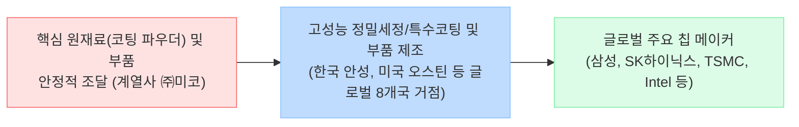

# 🔍 Phase 1: 기업 해독기 (심층 팩트체크 코어)
**분석 대상**: 코미코 (KoMiCo)
**기준 데이터**: 최근 5년 DART 공시 (Track A) + 산업 딥리서치 (Track B)

---

## 1. 비즈니스 모델 및 돈 버는 구조

[공시 팩트] 코미코는 고가의 반도체 공정 장비 부품을 재생하는 **정밀세정(Cleaning)** 및 **특수코팅(Coating)** 사업을 주력으로 영위하며, 최근 미코세라믹스를 연결 편입하여 **고기능성 세라믹 부품** 분야로 비즈니스 모델을 확장했습니다. 

### 🔗 밸류체인 다이어그램

## 2. 주요 제품별 매출 비중 추이 (2021~2026.1H)

[공시 팩트] 2023년 미코세라믹스 연결 편입 이후, 기존 세정/코팅 비중이 감소하고 부품 비중이 전체 매출의 절반 이상을 장악하며 사업 구조가 대폭 개편되었습니다.

| 구분 | 핵심 내용 (2026년 반기 기준) | 비고 (과거 대비 트렌드) |
| :--- | :--- | :--- |
| **세라믹 부품** | 169,300백만 원 (**50.8%**) | 21년(7.2%) 대비 비중 폭증, 캐시카우 등극 |
| **특수 코팅** | 89,200백만 원 (**26.8%**) | 과거 50%대 비중에서 점진적 축소 |
| **정밀 세정** | 74,500백만 원 (**22.4%**) | 20~30% 대 박스권 유지 중 |

## 3. 전사 영업이익률 및 FCF 추이

[공시 팩트] 매출은 지속적으로 신기록을 경신하고 있으나, 대규모 글로벌 확장 투자 여파로 영업이익률이 감소하고 FCF는 극심한 적자를 보이고 있습니다.

| 구분 | 핵심 내용 (2026년 반기 기준) | 비고 (과거 대비 트렌드) |
| :--- | :--- | :--- |
| **매출 및 영업이익** | 반기 매출 3,330억 원 / 영업이익 475억 원 | 외형(매출)은 YoY +18.5% 팽창하나 이익은 둔화 |
| **영업이익률 (OPM)** | **14.26%** | 2024년 22.18% 고점 이후 2년 연속 하락세 |
| **잉여현금흐름 (FCF)** | **-877억 원 적자** (CapEx 1,178억 반영) | 25년(-1,815억 원)에 이은 2년 연속 대규모 마이너스 흐름 지속 |

## 4. 핵심 KPI 추이 및 분석

[시장 내러티브] 전방 산업 둔화와 고금리로 인해 전반적인 부품사 가동률이 저하되고 실적 반등이 지연되고 있다.
[공시 팩트] 코미코의 가동률은 지역 및 품목별로 극심한 혼조세를 보입니다. 가장 규모가 큰 **미국 오스틴법인의 세정 가동률은 26년 반기 92.2%로 이미 풀가동 상태**이나, 코팅은 39.7%로 저조합니다. 한국 안성법인 역시 세정 52.2%, 코팅 70.3% 수준에 머물고 있습니다. 반면, **수출 비중은 2021년 2.6%에서 2025년 29.5%까지 수직 상승**하며 글로벌화가 빠르게 진척되고 있습니다.

## 5. 경영진 및 주주환원 이력

[공시 팩트] 대규모 차입에 의한 현금 고갈 상태임에도 불구하고, 주주환원 의지는 역설적으로 매우 강력합니다.

| 구분 | 핵심 내용 | 비고 |
| :--- | :--- | :--- |
| **자사주 영구 소각** | 최근 3년 및 26년 반기 내 **소각 이력 전무(0건)** | 신탁으로 20만여 주 매입 이력은 존재 |
| **배당 성향** | **28.3%** (2025년 기준) | 3개년 평균 25% 이상으로 지속 상향 기조 유지 |
| **지배구조 안정성** | (주)미코 최대주주 지분 **41.85%** | 정관 변경을 통해 분기배당 전격 도입 완료 |

## 6. 핵심 리스크 3가지

[공시 팩트] 글로벌 확장의 이면에는 원가 및 재무적 아킬레스건이 매우 뚜렷하게 존재합니다.

| 구분 | 핵심 내용 | 비고 |
| :--- | :--- | :--- |
| **원재료 특수관계인 편중** | 핵심 원자재인 코팅파우더 등을 계열사 (주)미코로부터 대다수 수급 | 내부거래 비율 과다 및 단가 인상 압박 시 방어 취약 |
| **고객사 및 전방산업 연동** | 삼성/SK/TSMC 감산 시 수주 즉각 타격 | 웨이퍼 투입량에 완벽히 동행하는 매출 구조 |
| **막대한 차입금 및 환율 노출** | 대규모 CapEx로 25년 기준 총차입금 **4,892억 원 돌파** | 고금리 이자 비용 가중 및 글로벌 8개국 환차손 리스크 심화 |

## 7. 딥리서치 팩트체크 요약

[시장 내러티브] 딥리서치(Track B)에 따르면, AI 서버 수요 폭증으로 2025~2026년 글로벌 메모리 전공정 장비(WFE) 투자가 반등하고, 삼성 P4 D1c 및 SK하이닉스 M15X 라인이 가동될 전망입니다.

[공시 팩트] 칩 메이커들의 전공정 투자가 재개되면, 가동 장비의 수율 향상 및 수명 연장을 위한 정밀세정/코팅 수요와 세라믹 부품 교체 수요가 동시에 폭증합니다. 특히 오스틴 법인의 세정 가동률이 이미 92%를 상회하는 상황에서 북미 중심의 투자가 가속화되면 즉각적인 실적 턴어라운드가 가능합니다. 다만, 지난 3년간 쏟아부은 **막대한 글로벌 CapEx(미국/체코 등) 투자분을 매출 레버리지로 얼마나 빨리 회수하여 FCF(잉여현금흐름) 흑자로 전환할 수 있는지**가 멀티플 상향의 핵심 트리거로 작용할 것입니다.
