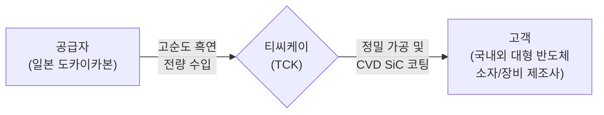

# 📊 [Phase 1: 기업 해독기] 티씨케이(TCK) 비즈니스 모델 분석

## 1. 2분 드릴 한 문장
> **[공시 팩트]** 이 회사는 반도체를 만들 때 닳아 없어져 주기적으로 교체해야 하는 핵심 소모성 부품(흑연 받침대 및 SiC 링 등)을 정밀하게 만들어, 국내외 대형 반도체 소자 및 장비 회사들에 직접 납품하고 그 대가로 돈을 법니다. (제31기 사업보고서)

## 2. 돈 버는 구조 (밸류체인)

*(출처: [공시 팩트] 제31기 사업보고서)*

## 3. 매출 구성
**[공시 팩트] 최근 3개년 제품군별 매출액 및 비중** (단위: 백만 원)
| 사업부문 / 제품군 | 2023년 | 2024년 | 2025년 |
| :--- | :---: | :---: | :---: |
| **Solid SiC 부문** (반도체 공정용 링 등) | 179,551 (**79.2%**) | 224,488 (**81.4%**) | 254,804 (**84.6%**) |
| **Graphite 부문** (반도체용 고순도 흑연) | 27,962 (12.3%) | 31,513 (11.4%) | 33,020 (11.0%) |
| **Susceptor 부문** (LED/ALD 장비 부품) | 16,653 (7.3%) | 18,361 (6.7%) | 12,383 (4.1%) |
| **Graphite 부문** (태양광용 고순도 흑연) | 1,202 (0.5%) | 784 (0.3%) | 709 (0.2%) |
| **기타 부문** (상품 매출) | 1,285 (0.6%) | 579 (0.2%) | 419 (0.1%) |
| **총합계 (Total)** | **226,653** | **275,725** | **301,334** |
| **전사 영업이익률 (OPM)** | **29.4%** | **29.3%** | **27.8%** |

**[공시 팩트] 지역별 매출 비중 (2025년 기준)**
* **국내 매출**: 35.6% (1,073억 원)
* **해외 매출 (수출)**: 64.4% (1,940억 원) - 주요 수출국: 미국(40.8%), 중국(22.3%)

## 4. 고객 & 경쟁사
* **[공시 팩트] 주요 매출처 편중**: 티씨케이의 상위 4대 고객사 매출 비중은 **70.9% (2,137억 원)**에 달합니다. 2023년(58.2%), 2024년(65.9%)에 이어 고객사 편중 현상이 점진적으로 심화되고 있습니다.
* **[공시 팩트] 주요 경쟁사 (특허 분쟁 기반)**: 
  * 디에스테크노 (현재 1심 진행 중)
  * 주식회사 와이엠씨/와이컴 (2025년 7월 소송 합의 및 취하 완료)
  * FTAK/지제이코리아 (2024년 2월 승소 종결)

## 5. 업종 핵심 KPI: 가동률 및 생산능력
**[공시 팩트] 주력 공장(안성공장 Solid SiC) 가동률 추이**
| KPI | 2021년 | 2022년 | 2023년 | 2024년 | 2025년 | 2026년 1Q |
| :--- | :---: | :---: | :---: | :---: | :---: | :---: |
| **공장 가동률** | 98.0% | 98.0% | 61.0% | 75.0% | **96.0%** | **95.8%** |
| **생산 능력 (억 원)** | 1,466 | 1,687 | 1,347 | 1,716 | **1,916** | **598** |

## 6. 경영진 & 주주환원
* **[공시 팩트] 대표이사**: 오창민 대표이사 사장 (삼성전자재팬(주) 대표이사 출신)
* **[공시 팩트] 지배구조 특이점**: 일본 도카이카본(TOKAI CARBON CO., LTD.)이 **52.6%** 지분을 보유한 과반 지배주주로, 원재료(흑연)의 100%를 독점 매입하고 있습니다.
* **[공시 팩트] 주주환원 및 유통주식수 변화**: 
  * 3년 연속 배당성향 **22.9%** 고수
  * 2025년 12월 19일, 약 500억 원 규모의 자사주 이익소각 단행. **실제 유통주식수 4.24% 영구 감소** (11,675,000주 → 11,179,416주).

## 7. 망하는 시나리오 & 리스크 3개
> **망하는 극단적 시나리오**
> [공시 팩트] 유일한 원자재 공급선이자 최대주주인 일본 도카이카본이 돌연 흑연 공급을 차단하고, 장기 진행 중인 특허 침해 소송에서 최종 패소하여 시장 독과점 지위가 해제된 상황에서 상위 4대 고객사(70.9% 비중)가 벤더를 다변화하며 이탈해버리는 시나리오.

**[공시 팩트] 가장 치명적인 리스크 3가지**
1. **원자재 공급망 리스크**: 고순도 흑연 대체 조달 우회로 부재 (최대주주 전량 의존)
2. **특허 붕괴 리스크**: 디에스테크노와의 1심 특허 침해 소송 패소 시 마진 파괴 경쟁 돌입
3. **고객사 편중 리스크**: 상위 4대 고객사에 70.9% 의존, 단일 고객사 CAPEX 삭감 시 직격탄

## 8. 핵심 재무 (최근 3~5년 추이)
**[공시 팩트] 4대 재무 지표 및 YoY** (단위: 백만 원)
| 재무 지표 | 2023년 | 2024년 | 2025년 | YoY (24→25) |
| :--- | :---: | :---: | :---: | :---: |
| **매출액** | 226,653 | 275,725 | 301,334 | **+9.3%** |
| **영업이익** | 66,703 | 80,748 | 83,887 | **+3.9%** |
| **FCF (잉여현금흐름)** | -26,454 | 66,851 | 49,614 | **-25.8%** |
| **순부채 (Net Debt)** | 순현금 | 순현금 | 순현금 | 무차입 경영 유지 |

## 9. 아직 모르는 것 (핵심 질문 2가지)
* **[공시 팩트 기반 질문] 주주환원 플랜**: 무차입 구조에 2,800억 원 이상의 고금리 예금성 유동자산을 보유 중인데, 향후 정기적인 자사주 추가 매입 및 소각 로드맵 가동 의사가 있는가?
* **[공시 팩트 기반 질문] CAPA 병목 및 투자 회수**: 안성 신공장 완공이 당초 대비 2년 연기된 2026년 6월로 지연됨에 따라, 하반기 반도체 공정 가동률 회복 시 생산능력 병목현상 우려는 없는가?

## 10. 공시 문장 변화(Filing Diff) & 약속 이행률
* **[공시 팩트] 톤 다운**: 과거 2021~2022년의 "탁월한 이익 창출 및 공정 우위"라는 공세적 단어가 사라지고, 최근엔 "지속 성장 기틀 및 신중한 연구개발 중심 대응"으로 신중하게 변경되었습니다.
* **[공시 팩트] 약속 이행률**: 
  * 생산설비 342.6억 투자: **100% 완료** (2024.07)
  * 안성 신공장 부지 256.9억 투자: 2024년 완공 목표였으나 2026년으로 연기. 현재 누계 205.5억 원 투입으로 약 **80% 진행 중**.

## 11. 산업 딥 리서치 영향도
* **[공시 팩트]** 업로드된 문서 중 산업/섹터 딥리서치 보고서가 부재하므로 생략합니다.
