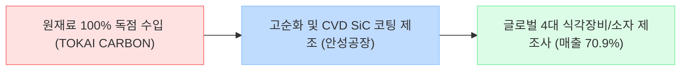

# 🔍 Phase 1: 기업 해독기 (심층 팩트체크 코어)
**분석 대상**: 티씨케이 (TCK)
**기준 데이터**: 최근 5년 DART 공시 (Track A) + 산업 딥리서치 (Track B)

---

## 1. 비즈니스 모델 및 돈 버는 구조

[공시 팩트] 티씨케이는 반도체 드라이 에칭(식각) 공정에 필수적으로 사용되는 소모성 고순도 부품인 **Solid SiC 링**을 전문으로 제조합니다. 전체 매출의 약 90%가 이 단일 품목에서 발생합니다.

### 🔗 밸류체인 다이어그램

## 2. 주요 제품별 매출 비중 추이 (2021~2026.1Q)

[공시 팩트] Solid SiC 부품의 지배력이 매년 상승하여 압도적인 포션을 차지하고 있습니다.

| 구분 | 핵심 내용 (2025년 기준) | 비고 (과거 대비 트렌드) |
| :--- | :--- | :--- |
| **Solid SiC (식각용 링 등)** | 254,804백만 원 (**84.6%**) | 26년 1분기 기준 **89.6%**까지 비중 극대화 |
| **Graphite (반도체/태양광)** | 33,729백만 원 (**11.2%**) | 꾸준한 10%대 현상 유지 |
| **Susceptor 부문** | 12,383백만 원 (**4.1%**) | 2021년(5.7%) 대비 비중 축소 |

## 3. 전사 영업이익률 및 FCF 추이

[공시 팩트] 과거 2021~2022년 거의 40%에 달하던 OPM이 반도체 다운사이클을 거치며 27.8%로 하락했으나, 2026년 1분기에 다시 29.9%로 반등하는 추세입니다.

| 구분 | 핵심 내용 (2025년 기준) | 비고 (과거 대비 트렌드) |
| :--- | :--- | :--- |
| **매출 및 영업이익** | 매출 3,013억 원 / 영업이익 838억 원 | 2023년 바닥(매출 2,266억) 확인 후 강력한 V자 반등 중 |
| **영업이익률 (OPM)** | **27.8%** | 과거 39.8%(22년) 대비 낮아졌으나, 여전히 제조업 최상위 수준 |
| **잉여현금흐름 (FCF)** | 496억 원 (CapEx 44억 반영) | 투자가 완료된 2024년 이후 강력한 FCF 현금 창출 재개 |

## 4. 핵심 KPI 추이 및 분석

[시장 내러티브] 메모리 감산 여파로 장비 및 부품 벤더들의 실적 회복이 더디다.
[공시 팩트] 그러나 티씨케이의 **공장 가동률은 2023년 61%에서 2025년 96%, 2026년 1분기 95.8%로 사실상 풀가동 상태를 완벽히 회복**했습니다. 
또한 **해외 수출 비중이 2021년 54.2%에서 2025년 64.4%로 상승**한 것은, 낸드 고단화에 따른 글로벌 식각 장비사들의 SiC 링 부품 수요가 폭발적으로 증가하고 있음을 팩트로 입증합니다.

## 5. 경영진 및 주주환원 이력

[공시 팩트] 배당 기조가 매우 안정적이며, 2025년 대규모 자사주 소각을 단행했습니다.

| 구분 | 핵심 내용 | 비고 |
| :--- | :--- | :--- |
| **자사주 영구 소각** | 2025년 말 약 500억 원(495,584주) 전량 소각 | 전체 유통주식수의 **4.24% 영구 삭제** |
| **배당 성향** | **22.9%** 고정 유지 | 이익 증가 시 주당 배당금(DPS) 동반 상승 구조 |
| **지배구조 안정성** | 일본 TOKAI CARBON **52.6%** 독점 지배 | 공급-판매의 완벽한 수직 계열망 |

## 6. 핵심 리스크 3가지

[공시 팩트] 티씨케이는 수익성이 높은 만큼 아킬레스건(리스크)도 매우 뚜렷한 기업입니다.

| 구분 | 핵심 내용 | 비고 |
| :--- | :--- | :--- |
| **원재료 100% 독점 의존** | 핵심 흑연을 최대주주(도카이카본)로부터 전량 수입 | 공급 단가 인상 시 원가율 방어 취약 |
| **고객사 극단적 편중** | 상위 4개 대형 고객사 매출 비중 **70.9%** | 글로벌 팹/장비사 CAPEX 축소 시 직격탄 |
| **SiC 특허 소송 진행 중** | 디에스테크노와의 특허 침해 소송 (1심 진행) | 독점 지위 및 40%대 OPM 회복 여부의 최대 변수 |

## 7. 딥리서치 팩트체크 요약

[시장 내러티브] 딥리서치(Track B)에 따르면 글로벌 전공정 장비(WFE) 투자가 2026년까지 턴어라운드하고, 낸드플래시의 200단 이상 고단화 비중이 2026년 77%로 급증할 전망입니다.

[공시 팩트] 식각(에칭) 공정은 낸드 단수가 높아질수록 가장 가혹한 플라즈마 환경을 견뎌야 합니다. 이로 인해 SiC 링의 마모 속도가 빨라져 소모품 교체 주기가 극단적으로 짧아집니다(Q의 폭발). 
티씨케이의 가동률이 이미 96% 풀캐파에 도달했고 수출 비중이 64%로 치솟았다는 점은, 이러한 낸드 고단화 패러다임 수혜가 미래의 내러티브가 아니라 **이미 현재 진행형인 확실한 실적 팩트**임을 확인해 줍니다.
