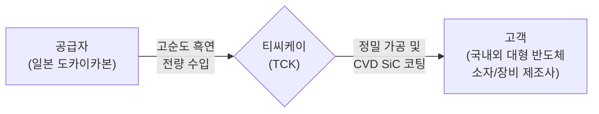

# 🏢 티씨케이(TCK) 마스터 분석 리포트

## 📊 [Phase 1: 기업 해독기] 비즈니스 모델 분석

### 1. 2분 드릴 한 문장
> **[공시 팩트]** 이 회사는 반도체를 만들 때 닳아 없어져 주기적으로 교체해야 하는 핵심 소모성 부품(흑연 받침대 및 SiC 링 등)을 정밀하게 만들어, 국내외 대형 반도체 소자 및 장비 회사들에 직접 납품하고 그 대가로 돈을 법니다. (제31기 사업보고서)

### 2. 돈 버는 구조 (밸류체인)

*(출처: [공시 팩트] 제31기 사업보고서)*

### 3. 매출 구성 및 경쟁사
* **[공시 팩트] 매출 구성 (2025년 기준)**: Solid SiC 부문(반도체 공정용 링)이 **84.6%**로 압도적 비중을 차지하며, 전사 영업이익률은 27.8%에 달합니다. 해외 수출이 64.4%로 미국(40.8%)과 중국(22.3%) 비중이 큽니다.
* **[공시 팩트] 고객사 편중 리스크**: 상위 4대 고객사 비중이 전체의 **70.9%**로, 소수 핵심 벤더에 실적이 크게 좌우됩니다.
* **[공시 팩트] 주요 경쟁사**: 디에스테크노(특허 1심 소송 진행 중), 와이엠씨(소송 취하 완료)

### 4. 재무 및 주주환원 추이
* **[공시 팩트] 재무 추이**: 2023년 침체를 겪은 후 2025년 매출액 3,013억(YoY +9.3%), 영업이익 838억(YoY +3.9%)으로 반등 중이나 FCF는 -25.8% 감소했습니다. 순부채는 '순현금' 상태로 완전한 무차입 경영 중입니다.
* **[공시 팩트] 주주환원**: 3년 연속 배당성향 22.9% 고수. 2025년 말 **500억 원 자사주 소각(유통주식수 4.24% 감소)**을 통해 체질 개선을 증명했습니다.

---

## 📖 [Phase 2: 스토리 리더] 상황 변화 및 신뢰도 분석

### 1. 공시 문장 변화 (Filing Diff)
* **사라진 긍정 문구 (톤 다운)**
  - **[공시 팩트]** 2021년 38%대 영업이익률을 기록할 당시의 **"탁월한 이익 창출"**이라는 자신감 넘치는 수식어가 사라지고, **"신중한 연구개발 중심 대응"**이라는 방어적 톤으로 전격 수정되었습니다.

### 2. 가이던스 성적표 (한국형)
| 약속한 것 (과거 공시) | 실제 결과 | 달성 평가 | 출처 |
| :--- | :--- | :---: | :--- |
| **생산설비 342.6억 투자** | 2024.07.31부로 100% 집행 완료 | **달성** | [공시 팩트] |
| **안성 신공장 부지 256.9억 투자** | 2024년 완공 ➔ **2026년으로 2년 연기** | **진행중(지연)** | [공시 팩트] |
> 경영진은 투자를 무단 철회하지 않고 현금을 80% 이상 투입한 채 완공 시기만 늦추며 현실적이고 보수적인 재무 운용을 보여주어 신뢰도를 지켰습니다.

### 3. 최신 시장의 평가 (최근 6개월 리포트)
* **[시장 주장] 투자의견 및 목표가**: 주요 3개 증권사(한국투자, 삼성, KB) 모두 NAND 고단화의 폭발적 수요를 바탕으로 '매수(BUY)' 의견을 유지 중이며, 목표가는 **225,000원 ~ 405,000원**으로 넓게 분포되어 있습니다. (26년 8월 리포트 기준)

---

## 📈 [Phase 3: 가격 판독기] 역DCF (Reverse DCF)
지금 주가(167,300원)가 정당화되려면, 이 회사는 앞으로 얼마나 잘해야 할까요?

* **역DCF 기초 데이터**
  - 현재 시가총액: 약 1.87조 원 / 기업가치(EV): 약 1.58조 원
  - 최근 1년 FCF: 496억 원 / **3년 평균 FCF: 300억 원**
  > **[자동 감지] FCF 이상치 경고**: 최신 FCF가 3년 평균 대비 +65.3% 급증하여 왜곡 방지를 위해 '3년 평균 FCF(300억)'를 보수적 기준으로 삼습니다.

* **역DCF 산출 결과 (요구 성장률)** *(향후 10년 성장 후 영구성장률 2% 가정)*

| 할인율 (WACC) | 요구 성장률 (최신 FCF 496억 기준) | 요구 성장률 (3년 평균 FCF 300억 기준) |
| :--- | :---: | :---: |
| 8% (안정 낙관) | 10.2% | 16.8% |
| **9% (대형 우량)** | **12.5%** | **19.3%** |
| 10% (일반) | 14.7% | 21.6% |

## 💡 최종 결론 (Master Conclusion)
**"과거 10년의 영광을 뛰어넘는 '슈퍼 사이클'을 증명해야 하는 주가"**

티씨케이의 현재 주가(167,300원)는 시장의 일반적 할인율(9~10%) 적용 시, 3년 평균 현금창출력 대비 매년 **19.3% ~ 21.6%의 복리 성장**을 향후 10년 내내 달성해야만 정당화됩니다.

* **[시장 주장]** 시장 컨센서스는 SiC 링의 기술적 해자(독점적 지위)와 NAND 미세화 가속화로 인해 20%대의 초고속 장기 성장이 충분히 가능하다고 베팅하고 있습니다.
* **[공시 팩트]** 하지만 경영진의 최근 톤 다운, 신공장 투자 2년 지연, 그리고 진행 중인 디에스테크노와의 특허 분쟁은 여전한 불확실성으로 남아있습니다.

결론적으로, 현재 가격대에서의 매수는 **"특허 소송에서 무사히 방어하고, 예상되는 2026년 NAND 빅사이클의 열매를 1위 업체로서 독식할 것"**이라는 강력한 믿음에 투자하는 것입니다. 시장의 논리와 달리 실적 반등이 지연될 경우 밸류에이션 하락의 여지가 존재합니다.
