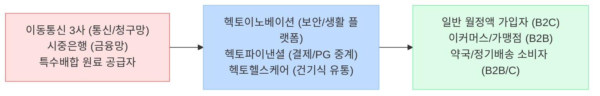

<!-- AI 작성 지침: 이 파일은 Phase 1 최종 보고서 템플릿입니다. 1_Raw_Data의 내용을 바탕으로 빈칸을 채우되, 기존 뼈대(Mermaid 다이어그램, 팩트/내러티브 대조표, 표 양식)를 절대 삭제하거나 축약하지 마십시오. 반드시 풍부한 데이터를 바탕으로 작성하십시오. -->

# 🔍 Phase 1: 기업 해독기 (심층 팩트체크 코어)
**분석 대상**: 헥토이노베이션
**기준 데이터**: 최근 5년 DART 공시 (Track A) + 산업 딥리서치 (Track B)

---

## 1. 비즈니스 모델 및 돈 버는 구조

[공시 팩트] 헥토이노베이션은 IT 보안(2차 본인인증) 및 생활 플랫폼을 기반으로 안정적인 B2C 구독 매출을 올리는 동시에, 2개의 강력한 종속회사를 통해 비즈니스를 다각화하고 있습니다. 전자결제 및 가상계좌 1위 사업자인 **'헥토파이낸셜'**을 통해 막대한 B2B 결제 수수료를 창출하며, **'헥토헬스케어'**를 통해 프리미엄 유산균(드시모네) 중심의 정기 배송 구독 경제를 이끌고 있습니다.

### 🔗 밸류체인 다이어그램

## 2. 주요 사업별 매출 비중 추이 (최근 5년 및 최신 분기)

[공시 팩트] IT 플랫폼, 핀테크(결제), 헬스케어의 3각 편대가 고르게 성장 중입니다. 특히 헥토파이낸셜의 결제 부문이 전사 외형의 절반 가까이를 견인하고 있으며, 헥토헬스케어 역시 2025년에 854억 원의 매출을 올리며 폭발적으로 성장하고 있습니다.

| 구분 | 핵심 내용 (2023~2025년 기준) | 비고 (과거 대비 트렌드) |
| :--- | :--- | :--- |
| **IT/보안/생활 플랫폼 (헥토이노베이션)** | 2025년 별도 매출 **1,203억 원** (비중 약 32%) | 매월 1,100원 등 소액결제 기반 구독형 모델로 이탈률이 매우 낮아 매년 외형 꾸준히 우상향 |
| **전자결제/PG (헥토파이낸셜)** | 2023년 매출 1,404억 원 (**48.67%**) | 전사 매출의 절반을 차지하는 확실한 캐시카우. 이커머스 거래액 증가에 따라 수수료 비례 상승 |
| **바이오/헬스케어 (헥토헬스케어)** | 2025년 매출 **854억 원**, 영업이익 98억 원 | 2024년 대비 매출 40% 고성장 및 1500억 규모 시노팜(중국) 수출 계약 체결로 글로벌 진출 |

## 3. 전사 영업이익률 및 FCF 추이

[공시 팩트] 연결 매출액은 매년 두 자릿수(10~17%) 성장을 거듭하며 2025년 3,758억 원을 달성했습니다. B2C 마케팅 등 고정비와 신규 플랫폼 투자 비용이 발생함에도 불구하고 전사 영업이익률은 13~15%의 탄탄한 방어력을 보여주고 있습니다.

| 구분 | 핵심 내용 (2025년 연결 기준) | 비고 (과거 대비 트렌드) |
| :--- | :--- | :--- |
| **매출 및 영업이익** | 매출 3,758억 원 / 영업이익 501억 원 | 전년 동기 대비 매출 +17.64%, 영업이익 +2.71% 증가 (매년 사상 최대 매출 갱신) |
| **영업이익률 (OPM)** | **13.35%** | 2021년 16.9% 대비 소폭 낮아졌으나, 신규 앱테크(발로소득) 투자기임에도 13%대의 높은 수익성 방어 성공 |
| **잉여현금흐름 (FCF)** | 2026년 상반기 연결 OCF **154억 원** 등 흑자 유지 | 공장이나 대규모 설비 투자가 필요 없는 IT 지식서비스 특성상 벌어들인 영업이익 대부분이 현금(FCF)으로 직결됨 |

## 4. 핵심 KPI 추이 및 분석

[시장 내러티브] IT 플랫폼 기업은 신규 서비스 출시에 따른 마케팅 출혈 경쟁으로 인해 이익률이 급락하고 내수 시장의 한계에 부딪힐 것이다.

[공시 팩트] 실제 공시를 확인한 결과, 당사는 공장이 없는 무형자산 기반 비즈니스로서 전사 재고자산 비율이 **불과 1.7 ~ 2.1%**에 그쳐 재고 리스크가 '제로(0)'에 가깝습니다. '발로소득', '더쎈카드' 등 B2C 플랫폼 확장을 위해 마케팅비가 소요되고 있으나, 이는 기존 본업(보안/간편결제)의 막대한 현금흐름으로 완벽히 커버되며 13%의 전사 OPM을 방어하고 있습니다. 또한 헬스케어 부문에서 **중국 국약약재와 1,550억 원 규모의 수출 계약**을 맺음으로써, 내수 100%라는 플랫폼 비즈니스의 한계를 돌파하기 시작했습니다.

## 5. 경영진 및 주주환원 이력

[공시 팩트] 상장사 최상위권의 주주환원 의지를 숫자로 증명하고 있습니다. 최대주주의 지배력이 대폭 강화된 가운데 3개년 주주환원계획(자사주 소각 + 배당 상향)을 한 치의 오차 없이 이행 중입니다.

| 구분 | 핵심 내용 | 비고 |
| :--- | :--- | :--- |
| **자사주 영구 소각** | 2024년 13.2만주, 2025년 13.1만주 연속 소각 | 매년 총 발행주식의 **1%를 정기적으로 소각**하는 매우 이례적이고 주주 친화적인 정책 실행 중 |
| **배당 성향** | **26.61% (2024년 별도 기준)** | 21%대에서 26%대로 지속 상향, 주당 배당금(DPS) 2025년 기준 500원 달성 |
| **지배구조 안정성** | 이경민 이사 (최대주주 지분율 **39.13%**) | 2024년 24%대에서 2025년 소유주식을 189만주 이상 대거 늘리며 책임경영 의지와 지배력 극대화 |

## 6. 핵심 리스크 3가지

[공시 팩트] 강력한 현금흐름에도 불구하고 B2B 핀테크 및 B2C 모바일 플랫폼 비즈니스가 가지는 구조적 위험 요소가 존재합니다.

| 구분 | 핵심 내용 | 비고 |
| :--- | :--- | :--- |
| **금융/결제 전산 오류 리스크** | 자회사 헥토파이낸셜의 대규모 금융사고 발생 시 타격 | 실시간 전송 오류나 보안사고 시 손해배상은 물론 플랫폼 신뢰도 추락으로 즉각적 고객 이탈 발생 가능성 |
| **앱테크/플랫폼 경쟁 심화** | '발로소득', '더쎈카드' 등 신규 육성 앱의 마케팅비 출혈 | 보상형(리워드) 앱 특성상 충성도가 낮아 타사 앱 이탈 우려가 상존하며, 투자금 회수 지연 가능성 |
| **통신사 의존도 리스크** | 본업(보안/생활)의 매출 정산이 이동통신 3사에 강하게 묶여있음 | 통신사들의 정책 변경이나 부가서비스 가입 절차 규제 강화 시, 핵심 B2C 구독 가입자 유치에 직접적 타격 |

## 7. 딥리서치 팩트체크 요약

[시장 내러티브] 헥토이노베이션은 더 이상 단순한 휴대폰 본인인증(문자) 회사가 아니며, 핀테크와 헬스케어를 양날개로 장착한 종합 생활 플랫폼 기업으로 도약하여 강력한 현금 창출력을 보일 것이다.

[공시 팩트] 2025년 실적 공시(전사 매출 3,758억 돌파 및 헥토헬스케어 854억 고성장)와 최대주주의 폭발적인 지분 매입(39.1%), 그리고 약속된 자사주 소각 이행 팩트는 위 내러티브가 '실제 진행 중인 현실'임을 정확히 대변합니다. 본업의 안정적인 B2B/B2C 캐시카우를 땔감 삼아 배당과 소각을 실시하면서 신사업(앱테크, 해외수출)을 키워가는 완벽한 가치주/성장주 혼합 모델의 형태를 갖추었습니다.
